# WSC Customer Portal — Execution Roadmap (Greenfield)
# Roadmap de Ejecución — Portal de Clientes WSC (Greenfield)

> 🇬🇧 **Purpose:** a single source of truth for *what to build*, *how deep each piece must go*, and *in what order*, so any engineer can pick up a pillar and advance it. This is a **greenfield** build — the only pre-existing asset is a static `index.html` design prototype.
>
> 🇪🇸 **Propósito:** una única fuente de verdad de *qué construir*, *qué tan profundo debe ir cada pieza* y *en qué orden*, para que cualquier ingeniero pueda tomar un pilar y avanzarlo. Es un proyecto **greenfield** — el único activo previo es un prototipo estático `index.html`.
>
> **SSOT:** Salesforce · **Companion doc:** [`docs/ARCHITECTURE-AND-ROADMAP.md`](docs/ARCHITECTURE-AND-ROADMAP.md) (deep rationale / justificación profunda).
>
> 📌 **Live status (2026-07-16):** Phase 0 **done**; a working demo (Login + Dashboard reading
> real Salesforce) exists ahead of plan. Current state, gaps & the updated action plan live in
> [`docs/STATUS.md`](docs/STATUS.md) — read that for "where we are / what's missing / what's next".

---

## 0. How to read this document / Cómo leer este documento

### 0.1 Depth scale / Escala de profundidad

> 🇬🇧 "Depth" = how much design, care, and testing a piece truly needs — *not* just hours. Use it to decide where to slow down.
> 🇪🇸 "Profundidad" = cuánto diseño, cuidado y testing necesita de verdad una pieza — *no* solo horas. Úsala para decidir dónde ir despacio.

| Depth | Meaning (EN) | Significado (ES) | Care required / Cuidado |
|:---:|---|---|---|
| **D1 🟢** | Wiring / config only | Solo cableado / configuración | Copy-paste + verify |
| **D2 🟡** | Standard implementation | Implementación estándar | Follow known patterns |
| **D3 🟠** | Custom logic, needs design | Lógica propia, requiere diseño | Design review + tests |
| **D4 🔴** | Core invariant / security-critical | Invariante núcleo / crítico de seguridad | Design doc + adversarial tests + review |

### 0.2 Effort scale / Escala de esfuerzo

> 🇬🇧 Estimates assume a small team: **~2 backend, ~1 frontend, part-time SF admin**. Ranges, not promises.
> 🇪🇸 Estimaciones asumen un equipo pequeño: **~2 backend, ~1 frontend, admin SF a tiempo parcial**. Rangos, no promesas.

`XS` ≤ 0.5 día · `S` 1–2 días · `M` 3–5 días · `L` 1–2 semanas · `XL` 2–4 semanas

### 0.3 Status markers / Marcadores de estado

`[ ]` todo · `[~]` in progress / en progreso · `[x]` done / hecho · `[!]` blocked / bloqueado

---

## 1. Current state & target / Estado actual y objetivo

> 🇬🇧 **What exists today:** one file, `index.html` (~410 lines): a visual mockup with hardcoded data, fake login (`display` toggle), no framework, no build, no backend, no Salesforce connection. **0 tests, 0 dependencies, 0 endpoints.**
> 🇪🇸 **Lo que existe hoy:** un archivo, `index.html` (~410 líneas): mockup visual con datos hardcoded, login falso (toggle de `display`), sin framework, sin build, sin backend, sin conexión a Salesforce. **0 tests, 0 dependencias, 0 endpoints.**

> 🇬🇧 **What the prototype gives us for free** (do NOT re-discover): the domain model, the canonical status pipeline, the magic-link auth pattern, and the brand design tokens (navy/red/gold).
> 🇪🇸 **Lo que el prototipo nos regala** (NO re-descubrir): el modelo de dominio, el pipeline de estado canónico, el patrón de auth magic-link, y los design tokens de marca (navy/red/gold).

**Canonical status pipeline / Pipeline de estado canónico:**
`To Verify Payment → Pending Balance → Initial Contact → Work Started → Waiting to Ship → Shipped → Delivered → Complete`

**Target architecture / Arquitectura objetivo:**

```
┌────────────┐   magic-link JWT   ┌─────────────────────┐  OAuth2 JWT Bearer  ┌──────────────┐
│  SPA (web) │ ──────────────────►│  BFF (Node + TS)    │ ──────────────────► │  Salesforce  │
│ React + TS │◄── SSE (realtime) ─│  hexagonal, cached  │◄── Pub/Sub API ──── │   (SSOT)     │
└────────────┘                    └─────────┬───────────┘   (gRPC events)     └──────────────┘
                                            │
                        ┌───────────────────┼───────────────────┐
                        ▼                   ▼                   ▼
                     Stripe            S3 (docs, KMS)         Redis (cache)
                   DocuSign          Object Lock WORM       catalog read-only
```

---

## 2. The 5 Pillars — Depth Profile / Los 5 Pilares — Perfil de Profundidad

> 🇬🇧 Per-pillar summary of *how deep* each area must go and *why*. Detailed tasks live in the phases (§3).
> 🇪🇸 Resumen por pilar de *qué tan profundo* debe ir cada área y *por qué*. Las tareas detalladas viven en las fases (§3).

### Pillar 1 — Data Model & Salesforce Integration

| Sub-component / Sub-componente | Depth | Effort | Why this depth / Por qué esta profundidad |
|---|:---:|:---:|---|
| Standard objects (Account, Contact, Opportunity, Case, Order) | D2 🟡 | S | Native config + a few custom fields |
| Custom objects (`Shelf_Corp__c`, `Document__c`, `Credit_Profile__c`, `Payment__c`, `Portal_Event__c`) | D3 🟠 | M | Schema decisions drive everything downstream |
| Status pipeline mapping (picklist + automation) | D3 🟠 | S | Wrong states = wrong UX + reporting forever |
| **Auth — Headless + JWT Bearer** | D4 🔴 | M | Security-critical; two identity planes; token custody |
| **Realtime — Pub/Sub API + SSE** | D3 🟠 | M | Persistent gRPC subscription + fan-out + reconnection |

> 🇬🇧 **Deepest here:** Auth (D4) — the JWT Bearer flow authenticates the *server*, not the customer; if you leak the SF token to the browser, the whole model breaks.
> 🇪🇸 **Lo más profundo aquí:** Auth (D4) — el JWT Bearer autentica al *servidor*, no al cliente; si filtras el token de SF al browser, todo el modelo se rompe.

### Pillar 2 — Core Features & Business Logic

| Sub-component / Sub-componente | Depth | Effort | Why / Por qué |
|---|:---:|:---:|---|
| **Anti-double-sale reservation** (serialized inventory) | D4 🔴 | M | The #1 business invariant — one entity sells once |
| Catalog listing + caching | D2 🟡 | S | Read-only, cacheable |
| Checkout + Stripe (installments) | D3 🟠 | M | Money + idempotency + webhooks |
| E-signature (DocuSign/PandaDoc) | D3 🟠 | M | Envelope templating + callbacks |
| Document vault (S3 + `Document__c`) | D3 🟠 | M | Presigned URLs + row-level authz + WORM |
| Support cases → Service Cloud | D2 🟡 | S | Reuses realtime channel |

> 🇬🇧 **Deepest here:** the reservation logic (D4). It is the only place Salesforce cannot be treated as a read-only DB — it needs an atomic, locked Apex transaction.
> 🇪🇸 **Lo más profundo aquí:** la lógica de reserva (D4). Es el único lugar donde Salesforce no puede tratarse como BD de solo lectura — necesita una transacción Apex atómica con lock.

### Pillar 3 — Gap Analysis & Cross-cutting

| Sub-component / Sub-componente | Depth | Effort | Why / Por qué |
|---|:---:|:---:|---|
| Codebase audit | ✅ done | — | Verdict: nothing to refactor, it's a mockup |
| Security (PII, encryption, token rotation) | D4 🔴 | L | EIN/credit/legal docs = sensitive PII |
| API-limit strategy (Redis + CDC invalidation) | D3 🟠 | M | Catalog read load can exhaust SF limits |
| Compliance surface (KYC/AML, audit log) | D3 🟠 | M | Impacts data model + retention |

### Pillar 4 — Execution Roadmap

> 🇬🇧 The phases in §3 *are* Pillar 4, fully expanded.
> 🇪🇸 Las fases en §3 *son* el Pilar 4, completamente expandido.

### Pillar 5 — Code Quality

| Sub-component / Sub-componente | Depth | Effort | Why / Por qué |
|---|:---:|:---:|---|
| Hexagonal architecture (ports & adapters) | D3 🟠 | M | SF as swappable adapter; testable without SF |
| Standardized error handling + retry/backoff | D3 🟠 | S | SF 5xx / rate limits are a *when*, not an *if* |
| Idempotency (webhooks, order/payment creation) | D3 🟠 | S | Prevents duplicate orders/charges |
| Strict TypeScript + zod at boundaries | D2 🟡 | S | Static types must not lie at runtime |

---

## 3. Execution Phases (Pillar 4) / Fases de Ejecución (Pilar 4)

> 🇬🇧 Each task has: **depth · effort · Definition of Done (DoD) · dependencies**. Do phases roughly in order; within a phase, respect the dependency notes.
> 🇪🇸 Cada tarea tiene: **profundidad · esfuerzo · Definición de Hecho (DoD) · dependencias**. Haz las fases en orden aproximado; dentro de una fase, respeta las dependencias.

---

### Phase 0 — Foundations & Decisions / Fase 0 — Cimientos y Decisiones

**Goal / Objetivo:** freeze the stack, stand up the empty skeleton, no business logic yet.
**Duración estimada / Estimated:** ~1 week / ~1 semana.

- [x] **0.1** Lock the stack & write ADRs (Architecture Decision Records). — **D3 🟠 · S**
  - *EN DoD:* `docs/adr/` contains ADRs for: Headless vs Experience Cloud, S3 vs SF Files, Platform Events vs Outbound Messages, Payments=Stripe. Each ADR states context, decision, consequences.
  - *ES DoD:* `docs/adr/` con ADRs de: Headless vs Experience Cloud, S3 vs SF Files, Platform Events vs Outbound Messages, Pagos=Stripe. Cada ADR: contexto, decisión, consecuencias.
- [x] **0.2** Monorepo scaffold (pnpm + turbo): `apps/web`, `apps/bff`, `packages/shared`. — **D1 🟢 · S**
  - *DoD:* `pnpm install && pnpm build` green; empty apps boot; shared package imports across both.
- [x] **0.3** Tooling baseline: ESLint, Prettier, `tsconfig` with `strict:true`, `noUncheckedIndexedAccess`. — **D1 🟢 · XS**
  - *DoD:* `pnpm lint && pnpm typecheck` pass on the empty skeleton.
- [x] **0.4** CI pipeline (GitHub Actions): install → lint → typecheck → test → build on every PR. — **D2 🟡 · S**
  - *DoD:* a trivial PR runs the pipeline green; failing lint blocks merge.
- [x] **0.5** Environments defined: `local`, `staging`, `prod`; secrets via a secrets manager (never committed). — **D2 🟡 · S**
  - *DoD:* `.env.example` documents every var (see Appendix C); real secrets live in the manager.
- [x] **0.6** Provision a **Salesforce sandbox / scratch org** for dev. — **D2 🟡 · S**
  - *DoD:* SFDX project created; can deploy/retrieve metadata; a dev can log in.

**Depth note / Nota de profundidad:** 0.1 is D3 because the ADRs are the contract the rest of the team builds against — don't rush them. / 0.1 es D3 porque los ADRs son el contrato contra el que construye el equipo — no los apresures.

---

### Phase 1 — Infrastructure & Authentication / Fase 1 — Infraestructura y Autenticación

**Goal / Objetivo:** a request can flow browser → BFF → Salesforce, authenticated end-to-end.
**Estimated:** ~2 weeks / ~2 semanas.

> ⚠️ **Status update (see [`docs/STATUS.md`](docs/STATUS.md) §3–§5):** the sandbox is provisioned,
> and a BFF→Salesforce read path already works in dev (reusing the CLI session via `@salesforce/core`
> — no Connected App). Two changes vs. the original plan: **(1.1) the custom objects ALREADY EXIST**
> in the org (`FU_User__c`/`Online_Order__c`/`SC_Corp__c`/`Online_Payment__c`) → this becomes *map to
> existing*, not *create*. **(1.4) creating a Connected App is BLOCKED by the org**, but a JWT Bearer
> flow via an **External Client App** works and is implemented (`PORTAL_DATA_SOURCE=salesforce-jwt`)
> — see `docs/STATUS.md` G2. **Customer auth (1.7/1.8) is DECIDED** by
> [ADR-0005](docs/adr/0005-customer-identity-magic-link.md): BFF-native magic-link, not Auth0/Cognito.
> Also: 1.8's "email → `Contact.Id`" is corrected to "email → `FU_User__c.Id`" (no standard Contact
> in this org).

#### 1.A Salesforce data model / Modelo de datos en Salesforce
- [ ] **1.1** Create custom objects + fields (`Shelf_Corp__c`, `Document__c`, `Credit_Profile__c`, `Payment__c`, `Portal_Event__c`). — **D3 🟠 · M**
  - *EN DoD:* objects deployed to sandbox via SFDX; every field from the data-model table exists with correct types; `Shelf_Corp__c.Status__c` picklist = `Available/Reserved/Sold`.
  - *ES DoD:* objetos desplegados al sandbox vía SFDX; cada campo de la tabla del modelo existe con tipos correctos; picklist `Status__c` = `Available/Reserved/Sold`.
  - *Depends on:* 0.6.
- [ ] **1.2** Add custom fields to standard objects (`Opportunity.Order_Status__c`, `Advisor__c`, `Shelf_Corp__c` lookup; `Contact.Portal_User_Id__c`; `Account.KYC_Status__c`). — **D2 🟡 · S**
  - *DoD:* fields deployed; `Order_Status__c` picklist matches the canonical pipeline (§1).
- [ ] **1.3** Seed sandbox with sample `Shelf_Corp__c` inventory + one demo Account/Contact/Opportunity. — **D1 🟢 · XS**
  - *DoD:* catalog query returns ≥5 `Available` corps; the prototype's demo order reproducible.

#### 1.B Server-to-Salesforce auth (JWT Bearer) / Auth servidor-a-Salesforce
- [ ] **1.4** Generate X.509 keypair; create **Connected App** (digital signatures, upload cert). — **D3 🟠 · S**
  - *DoD:* Connected App exists; consumer key recorded in secrets manager; cert uploaded.
- [ ] **1.5** Create **integration user** + least-privilege **Permission Set** (only portal objects/fields). — **D4 🔴 · S**
  - *EN DoD:* integration user cannot read anything beyond portal scope; verified by attempting an out-of-scope query (must fail).
  - *ES DoD:* el integration user no puede leer nada fuera del alcance del portal; verificado intentando una query fuera de alcance (debe fallar).
- [ ] **1.6** Implement JWT Bearer flow in BFF: sign JWT, exchange for access token, cache + auto re-mint on expiry. — **D4 🔴 · M**
  - *EN DoD:* BFF obtains a token on boot; a `GET` to SF REST succeeds; token auto-refreshes after forced expiry; **token never leaves the server** (asserted in a test).
  - *ES DoD:* el BFF obtiene token al arrancar; un `GET` a SF REST funciona; el token se re-emite tras expiración forzada; **el token nunca sale del servidor** (aseverado en test).
  - *Depends on:* 1.4, 1.5.

#### 1.C Customer identity (magic-link) / Identidad del cliente (magic-link)
- [ ] **1.7** Configure IdP (Auth0 / Cognito / Supabase Auth) with passwordless email magic-link. — **D2 🟡 · S**
  - *DoD:* a user receives a magic-link email and lands with a valid JWT.
- [ ] **1.8** BFF middleware: verify IdP JWT → resolve `email → Contact.Id` → attach to request context. — **D4 🔴 · M**
  - *EN DoD:* requests without a valid JWT get `401`; valid ones carry the resolved `Contact.Id`; an unknown email is rejected (no auto-provisioning of strangers).
  - *ES DoD:* requests sin JWT válido reciben `401`; los válidos llevan el `Contact.Id` resuelto; un email desconocido se rechaza (sin auto-aprovisionar desconocidos).
  - *Depends on:* 1.6, 1.7.

#### 1.D Infra services / Servicios de infraestructura
- [ ] **1.9** Provision S3 bucket (private, versioning, SSE-KMS, Object Lock=compliance). — **D3 🟠 · S**
  - *DoD:* bucket blocks public access; a legal-doc object cannot be deleted before retention; KMS key rotation enabled.
- [ ] **1.10** Provision managed Redis (encryption at rest + in transit). — **D2 🟡 · XS**
  - *DoD:* BFF connects; a set/get round-trips.

**Phase 1 exit criteria / Criterios de salida de Fase 1:** an authenticated customer request reaches Salesforce and returns *their own* data only. / una petición autenticada de cliente llega a Salesforce y devuelve *solo sus propios* datos.

---

### Phase 2 — Core Endpoints & Sync / Fase 2 — Endpoints Core y Sincronización

**Goal / Objetivo:** read the domain over a typed API; realtime updates; the reservation lock exists.
**Estimated:** ~2–3 weeks / ~2–3 semanas.

- [ ] **2.1** Author the **OpenAPI contract** for the BFF (source of frontend types). — **D3 🟠 · M**
  - *EN DoD:* `openapi.yaml` covers catalog/orders/payments/profile/documents/cases/reserve; codegen produces a typed client consumed by `apps/web`.
  - *ES DoD:* `openapi.yaml` cubre catálogo/órdenes/pagos/perfil/documentos/casos/reserva; el codegen produce un cliente tipado consumido por `apps/web`.
- [ ] **2.2** Hexagonal skeleton in BFF: `domain/`, `application/` (use cases), `infrastructure/salesforce/` (adapter behind a `Repository` port). — **D3 🟠 · M**
  - *EN DoD:* a use case is unit-tested with an **in-memory repo** (no SF); the SF adapter is swapped only in integration tests.
  - *ES DoD:* un caso de uso se testea con un **repo en memoria** (sin SF); el adapter SF solo se usa en tests de integración.
- [ ] **2.3** Read endpoints: `GET /catalog`, `GET /orders/:id`, `GET /orders/:id/payments`, `GET /profile`, `GET /orders/:id/documents`. — **D2 🟡 · M**
  - *EN DoD:* each returns typed DTOs (never raw SF field names); row-level authz enforced (customer sees only their records); 404 vs 403 correctly distinguished.
  - *ES DoD:* cada uno devuelve DTOs tipados (nunca nombres crudos de campos SF); authz por fila aplicada (el cliente ve solo sus registros); 404 vs 403 correctamente distinguidos.
  - *Depends on:* 2.1, 2.2, 1.8.
- [ ] **2.4** Redis caching for `GET /catalog` (read-only): TTL + **CDC-driven invalidation**. — **D3 🟠 · M**
  - *EN DoD:* catalog served from cache; a `Shelf_Corp__c` status change (CDC) invalidates the key within seconds; transactional data is **never** cached.
  - *ES DoD:* catálogo servido desde caché; un cambio de estado de `Shelf_Corp__c` (CDC) invalida la clave en segundos; los datos transaccionales **nunca** se cachean.
- [ ] **2.5** 🔴 **Atomic reservation endpoint** — Apex transactional method with row lock (`FOR UPDATE`) exposed via REST. — **D4 🔴 · M**
  - *EN DoD:* `Available → Reserved` only if currently `Available`; two concurrent reservations of the same corp → exactly one wins, the other gets `409`; `Reserved_Until__c` set to now+15m; covered by an **adversarial concurrency test** (two parallel calls).
  - *ES DoD:* `Available → Reserved` solo si está `Available`; dos reservas concurrentes de la misma corp → exactamente una gana, la otra recibe `409`; `Reserved_Until__c` = ahora+15m; cubierto por un **test de concurrencia adversarial** (dos llamadas en paralelo).
  - *Depth note:* this is the single most important correctness task in the project. Write the design doc first.
- [ ] **2.6** Reservation TTL sweeper: scheduled job returns expired `Reserved` → `Available`. — **D3 🟠 · S**
  - *DoD:* a reservation past `Reserved_Until__c` is released; released corp reappears in catalog.
- [ ] **2.7** Realtime: BFF subscribes to **Pub/Sub API** (Platform Events + CDC), fans out to clients via **SSE** filtered by `Contact.Id`. — **D3 🟠 · M**
  - *EN DoD:* an order-status change in SF pushes to the right client's SSE stream in <2s; the BFF holds **one** SF subscription (not one per client); auto-reconnect with replay-id on drop.
  - *ES DoD:* un cambio de estado de orden en SF llega al stream SSE del cliente correcto en <2s; el BFF mantiene **una** suscripción SF (no una por cliente); reconexión automática con replay-id al caerse.

**Phase 2 exit criteria / Criterios de salida:** the whole domain is readable via typed endpoints, catalog is cached & event-invalidated, and the reservation lock provably prevents double-sale. / todo el dominio es legible vía endpoints tipados, el catálogo está cacheado e invalidado por evento, y el lock de reserva previene la doble venta de forma demostrable.

---

### Phase 3 — Transactions & Documents / Fase 3 — Transacciones y Documentos

**Goal / Objetivo:** a customer can pay, sign, and exchange documents end-to-end.
**Estimated:** ~2–3 weeks / ~2–3 semanas.

- [ ] **3.1** Stripe integration (PaymentIntents, installments: deposit + balance). — **D3 🟠 · M**
  - *EN DoD:* browser talks directly to Stripe Elements (PCI **SAQ-A**, BFF never sees card data); a successful PaymentIntent exists; amounts match the order.
  - *ES DoD:* el browser habla directo con Stripe Elements (PCI **SAQ-A**, el BFF nunca ve datos de tarjeta); existe un PaymentIntent exitoso; los montos coinciden con la orden.
- [ ] **3.2** Stripe **webhook** → verify signature → create `Payment__c` → advance `Order_Status__c`. **Idempotent.** — **D4 🔴 · M**
  - *EN DoD:* replaying the same webhook event creates **no** duplicate `Payment__c` (idempotency key on event id); signature-invalid webhooks rejected; payment verification moves state `To Verify Payment → Pending Balance`.
  - *ES DoD:* re-enviar el mismo evento webhook **no** crea `Payment__c` duplicado (idempotency key en el id del evento); webhooks con firma inválida se rechazan; la verificación de pago mueve el estado `To Verify Payment → Pending Balance`.
- [ ] **3.3** Full checkout orchestration: `reserve → pay → idempotent Opportunity create/update`. — **D4 🔴 · M**
  - *EN DoD:* a paid reservation becomes a `Sold` corp + updated Opportunity; retrying the flow (network blip) does **not** duplicate the Opportunity (`External_Id__c` upsert).
  - *ES DoD:* una reserva pagada se vuelve corp `Sold` + Opportunity actualizada; reintentar el flujo (corte de red) **no** duplica la Opportunity (upsert por `External_Id__c`).
  - *Depends on:* 2.5, 3.2.
- [ ] **3.4** E-signature (DocuSign/PandaDoc): generate contract from template → embedded signing → callback. — **D3 🟠 · M**
  - *DoD:* customer signs an envelope; the `completed` callback stores the signed PDF in the vault and advances to `Work Started`.
- [ ] **3.5** Document vault — upload: presigned `PUT` to S3 → confirm ETag/hash → create `Document__c`. — **D3 🟠 · M**
  - *EN DoD:* uploaded file's SHA-256 stored in `Document__c.Content_Hash__c`; oversized/wrong-type uploads rejected; `Document__c` linked to the Opportunity.
  - *ES DoD:* el SHA-256 del archivo se guarda en `Document__c.Content_Hash__c`; subidas sobredimensionadas/tipo-incorrecto se rechazan; `Document__c` ligado a la Opportunity.
- [ ] **3.6** Document vault — download: BFF authorizes by `Contact.Id` → issues short-lived presigned `GET`. — **D4 🔴 · M**
  - *EN DoD:* a customer can download only their own docs; presigned URL expires in ≤60s; an attempt to fetch another customer's `Document__c` returns `403`.
  - *ES DoD:* un cliente descarga solo sus propios docs; la URL presigned expira en ≤60s; intentar bajar el `Document__c` de otro cliente devuelve `403`.

**Phase 3 exit criteria / Criterios de salida:** money and legal documents move safely, idempotently, and with per-customer authorization. / el dinero y los documentos legales se mueven de forma segura, idempotente y con autorización por cliente.

---

### Phase 4 — Customer Portal (Frontend) / Fase 4 — Portal del Cliente (Frontend)

**Goal / Objetivo:** port the prototype into a real React app wired to the BFF, with live updates.
**Estimated:** ~2–3 weeks / ~2–3 semanas.

- [ ] **4.1** Extract prototype design tokens (navy/red/gold CSS vars) into a theme; set up component library. — **D2 🟡 · S**
  - *DoD:* the 5 views render with the prototype's exact look from a shared theme, not inline styles.
- [ ] **4.2** Routing + auth gate: magic-link callback, session, protected routes. — **D2 🟡 · S**
  - *DoD:* unauthenticated users hit login; authenticated users land on the dashboard.
- [ ] **4.3** Server-state layer with **TanStack Query** against the typed BFF client. — **D2 🟡 · S**
  - *EN DoD:* SF data is fetched via Query (cache/retry/invalidation); **no SF data in Redux/Zustand**; Zustand holds only session/UI state.
  - *ES DoD:* los datos de SF se traen vía Query (caché/reintento/invalidación); **nada de datos de SF en Redux/Zustand**; Zustand solo guarda sesión/estado de UI.
- [ ] **4.4** Port the 5 views: Dashboard, My Order, Payments, Documents, Profile. — **D2 🟡 · M**
  - *DoD:* each view renders real BFF data; progress bar derives from `Order_Status__c`; loading/empty/error states exist for each.
- [ ] **4.5** Live notifications via SSE (status change, payment verified, new doc, advisor reply). — **D3 🟠 · S**
  - *DoD:* a status change in SF updates the open portal without refresh; reconnects after network drop.
- [ ] **4.6** Support portal: create Case + view comment thread. — **D2 🟡 · S**
  - *DoD:* "Contact advisor" creates a Case (`Origin=Portal`); advisor replies appear via the same SSE channel.
- [ ] **4.7** Accessibility & responsive polish (prototype already has the 560px breakpoint). — **D2 🟡 · S**
  - *DoD:* keyboard-navigable, labeled inputs, contrast AA; mobile layout matches prototype.

**Phase 4 exit criteria / Criterios de salida:** a real user can log in and run their entire order lifecycle in the browser. / un usuario real puede entrar y correr todo el ciclo de su orden en el browser.

---

### Phase 5 — Testing, Hardening & Go-Live / Fase 5 — Pruebas, Endurecimiento y Salida a Producción

**Goal / Objetivo:** prove it's correct, secure, and within SF limits, then ship.
**Estimated:** ~2 weeks / ~2 semanas.

- [ ] **5.1** Unit tests (BFF): use cases + SF adapter with SF mocked; **focus on reservation logic**. — **D3 🟠 · M**
  - *DoD:* ≥ agreed coverage on `application/`; reservation edge cases (expired TTL, concurrent) covered.
- [ ] **5.2** Integration tests against a **sandbox/scratch org** (never prod) for real SOQL/Apex. — **D3 🟠 · M**
  - *DoD:* CI spins a scratch org, deploys, runs SF-backed tests, tears down.
- [ ] **5.3** E2E (Cypress/Playwright): magic-link → catalog → reserve → pay → sign → documents. — **D3 🟠 · M**
  - *DoD:* the full happy path passes headless in CI; one adversarial path (double-reserve) asserted.
- [ ] **5.4** Load testing (k6/Artillery): validate caching vs **SF API limits** under load; concurrency of reservation. — **D4 🔴 · M**
  - *EN DoD:* at target RPS the cache keeps SF calls under the daily limit budget; two users racing for one corp → exactly one succeeds under load.
  - *ES DoD:* al RPS objetivo la caché mantiene las llamadas a SF bajo el presupuesto del límite diario; dos usuarios compitiendo por una corp → exactamente uno gana bajo carga.
- [ ] **5.5** Security hardening: headers (HSTS/CSP), BFF rate-limiting, dependency scan, secret-leak scan, PII audit. — **D4 🔴 · M**
  - *EN DoD:* no secrets in repo; no PII in logs; row-level authz fuzzed; token rotation runbook exists.
  - *ES DoD:* sin secretos en el repo; sin PII en logs; authz por fila probada con fuzzing; runbook de rotación de tokens existe.
- [ ] **5.6** Observability: structured logging (no PII), request correlation id, SF-API-usage metrics + alerts. — **D2 🟡 · S**
  - *DoD:* dashboards show SF API consumption; an alert fires as it approaches the limit.
- [ ] **5.7** Go-live: feature flags, staged rollout, rollback runbook, on-call. — **D3 🟠 · S**
  - *DoD:* production deploy behind flags; documented one-command rollback; smoke tests green post-deploy.

**Phase 5 exit criteria / Criterios de salida:** correctness (esp. no double-sale), security (PII), and SF-limit resilience are all proven under load, and rollback is rehearsed. / la correctitud (sobre todo no doble venta), seguridad (PII) y resiliencia de límites SF están probadas bajo carga, y el rollback está ensayado.

---

## 4. Sequencing & milestones / Secuencia e hitos

```mermaid
gantt
    dateFormat  X
    axisFormat  wk%s
    section Foundations
    Phase 0 Foundations        :p0, 0, 1
    section Backend core
    Phase 1 Infra & Auth       :p1, after p0, 2
    Phase 2 Endpoints & Sync   :p2, after p1, 3
    section Transactions
    Phase 3 Payments & Docs    :p3, after p2, 3
    section Frontend
    Phase 4 Portal UI          :p4, after p2, 3
    section Release
    Phase 5 Test & Go-Live     :p5, after p3, 2
```



> 🇬🇧 **Parallelism:** Phase 4 (frontend) can start once Phase 2's OpenAPI contract (2.1) is stable — it doesn't need Phase 3 finished, only mocked payment/doc endpoints. This overlaps ~3 weeks.
> 🇪🇸 **Paralelismo:** la Fase 4 (frontend) puede empezar en cuanto el contrato OpenAPI de la Fase 2 (2.1) esté estable — no necesita la Fase 3 terminada, solo endpoints de pago/doc mockeados. Esto solapa ~3 semanas.

**Milestones / Hitos:**
- **M1 — "Hello Salesforce":** end of Phase 1 — authenticated request returns real customer data.
- **M2 — "Read-only portal":** end of Phase 2 — catalog + orders visible, reservation lock proven.
- **M3 — "Transactional":** end of Phase 3 — pay + sign + documents work.
- **M4 — "Feature complete":** end of Phase 4 — full UI on real data.
- **M5 — "Production":** end of Phase 5 — shipped behind flags.

**Rough total / Total aproximado:** ~11–13 weeks wall-clock with the overlap, for a small team. / ~11–13 semanas de calendario con el solape, para un equipo pequeño.

---

## 5. Cross-cutting standards (Pillar 5) / Estándares transversales (Pilar 5)

> 🇬🇧 These apply to **every** task above; they are not a phase.
> 🇪🇸 Aplican a **cada** tarea de arriba; no son una fase.

- **Hexagonal / SOLID:** domain never imports Salesforce. SF, Stripe, DocuSign, S3 are adapters behind ports (`ShelfCorpRepository`, `PaymentGateway`, `SignatureService`, `DocumentStore`). One use case per action.
- **Errors:** typed domain errors (`ShelfCorpAlreadyReserved`, `PaymentNotVerified`) → consistent HTTP codes (`409` reservation conflict, `402` payment required, `422` validation, `403` authz, `404` not found).
- **Retry/backoff:** exponential backoff + jitter on SF `5xx` / `REQUEST_LIMIT_EXCEEDED`; honor `Retry-After`; circuit breaker when SF degraded; **never** retry non-idempotent ops without an idempotency key.
- **Idempotency:** keys on Opportunity/Payment/Case creation and on all webhooks (Stripe, DocuSign, SF).
- **Types:** `strict:true`, no `any`; shared domain types in `packages/shared`; **zod** validation at every boundary (webhooks, requests) so static types don't lie at runtime.
- **Security everywhere:** row-level authz by JWT `Contact.Id`; no SF token to the browser; short-lived presigned URLs; no PII in logs.

---

## 6. Risk register / Registro de riesgos

| # | Risk / Riesgo | Impact | Where addressed / Dónde se aborda |
|:--:|---|:--:|---|
| R1 | **Double-sale** of a `Shelf_Corp__c` (non-atomic reservation) | 🔴 Critical | 2.5 (Apex lock), 2.6 (TTL), 5.4 (load concurrency) |
| R2 | **SF API-limit exhaustion** under catalog load | 🔴 High | 2.4 (Redis+CDC), 5.4 (load test), 5.6 (metrics/alerts) |
| R3 | **PII leakage** (EIN, credit, legal docs) | 🔴 High | 1.5/1.8 (authz), 3.6 (presigned), 5.5 (hardening) |
| R4 | **Duplicate orders/charges** on webhook replay | 🟠 Med | 3.2/3.3 (idempotency) |
| R5 | **SF token leak** to client | 🔴 High | 1.6 (server-only custody), 5.5 (audit) |
| R6 | **Compliance gap** (KYC/AML, retention) | 🟠 Med | data model (`Portal_Event__c`), legal review before prod |

---

## 7. Global Definition of Done / Definición de Hecho global

> 🇬🇧 A feature is "done" only when ALL hold:
> 🇪🇸 Una feature está "hecha" solo cuando se cumple TODO:

- [ ] Typed end-to-end (zod at boundaries, no `any`).
- [ ] Row-level authz enforced and tested (customer sees only their data).
- [ ] Errors mapped to correct HTTP codes; SF calls have retry/backoff.
- [ ] Idempotent where it creates money/records.
- [ ] Unit + (where relevant) integration/E2E tests green in CI.
- [ ] No secrets in repo, no PII in logs.
- [ ] Docs/ADR updated.

---

## Appendix A — Recommended stack / Stack recomendado

| Layer / Capa | Choice / Elección | Reason / Razón |
|---|---|---|
| Frontend | React + TypeScript + Vite | Reuses prototype; SPA is enough |
| Server state | TanStack Query | Cache/retry/event-invalidation |
| UI state | Zustand | Lightweight; avoid Redux |
| BFF | Node + TypeScript (Fastify/Nest) | One language full-stack; shared types |
| Customer auth | Auth0 / Cognito (magic-link) | Passwordless like the prototype; no SF licenses |
| SF auth | OAuth 2.0 JWT Bearer | Server-to-server |
| Realtime | Pub/Sub API + SSE | Modern CometD replacement |
| Payments | Stripe | PCI SAQ-A, installments, webhooks |
| E-sign | DocuSign / PandaDoc | Template envelopes |
| Files | S3 (SSE-KMS, Object Lock) | Scale + WORM legal hold |
| Cache | Redis | Catalog read-only, TTL + CDC invalidation |

## Appendix B — Repo structure / Estructura del repo

```
WSC-Custom-Portal/
├─ apps/
│  ├─ web/                 # React + TS (ports the prototype)
│  └─ bff/
│     ├─ domain/           # entities + typed errors
│     ├─ application/      # use cases
│     └─ infrastructure/   # salesforce/ stripe/ docusign/ s3/ redis/
├─ packages/shared/        # domain types + zod schemas
├─ sfdx/                   # Salesforce metadata (objects, Apex, permission sets)
├─ docs/
│  ├─ ARCHITECTURE-AND-ROADMAP.md
│  └─ adr/                 # Architecture Decision Records
├─ ROADMAP.md              # this file
└─ .github/workflows/      # CI/CD
```

## Appendix C — Environment variables / Variables de entorno

```
# Salesforce (JWT Bearer)
SF_LOGIN_URL, SF_CONSUMER_KEY, SF_INTEGRATION_USER, SF_PRIVATE_KEY   # secret
# Customer IdP
AUTH0_DOMAIN, AUTH0_AUDIENCE, AUTH0_CLIENT_ID
# Payments / E-sign / Files / Cache
STRIPE_SECRET_KEY, STRIPE_WEBHOOK_SECRET                            # secret
DOCUSIGN_INTEGRATION_KEY, DOCUSIGN_SECRET                           # secret
AWS_S3_BUCKET, AWS_KMS_KEY_ID, AWS_REGION
REDIS_URL
```

## Appendix D — Glossary / Glosario

| Term | EN | ES |
|---|---|---|
| BFF | Backend-for-Frontend: the API layer the SPA talks to | Capa API que el SPA consume |
| SSOT | Single Source of Truth = Salesforce | Única fuente de verdad = Salesforce |
| Serialized inventory | Each unit is unique, sells once | Cada unidad es única, se vende una vez |
| WORM | Write-Once-Read-Many (S3 Object Lock) | Escribir-una-vez-leer-muchas |
| CDC | Change Data Capture (SF record-change events) | Captura de cambios de datos |
| Idempotency | Same request twice = one effect | Misma petición dos veces = un solo efecto |
| Row-level authz | Access filtered per customer record | Acceso filtrado por registro de cliente |
