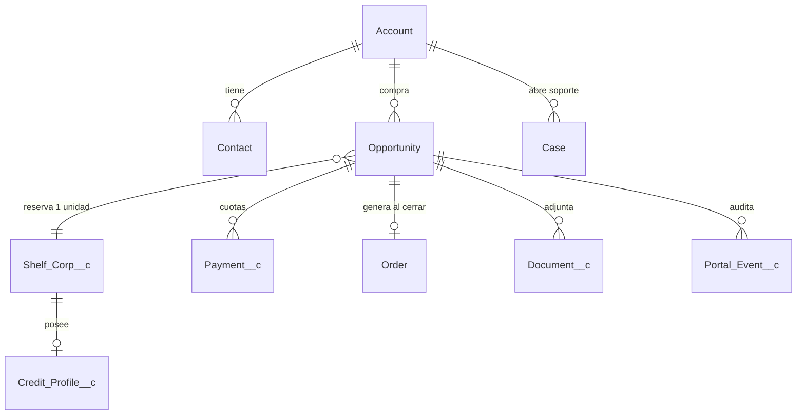

# WSC Customer Portal — Análisis Arquitectónico y Roadmap de Ejecución

> **Fuente de verdad (SSOT):** Salesforce.
> **Estado del repo (auditoría 2026-07-13):** un único `index.html` estático (mockup de UI, datos ficticios, sin backend, sin build, sin auth real).
> **Naturaleza real del proyecto:** *greenfield con prototipo de diseño*, no una app parcialmente construida.

---

## 0. Hallazgo de auditoría (reality check)

El "código base actual" es un solo archivo `index.html` (~410 líneas). Es un prototipo visual de alta fidelidad, no una aplicación. El pie de página lo declara: *"Prototype for demonstration only — not connected to Salesforce. All data shown is fictional."*

| Dimensión | Estado en el prototipo | Realidad |
|---|---|---|
| Framework frontend | Ninguno (HTML + `<style>` + un IIFE de ~25 líneas) | A construir |
| Build / tooling | Ninguno (`package.json`, tsconfig, bundler ausentes) | A construir |
| Gestión de estado | `classList.toggle('on')` sobre el DOM | A construir |
| Capa de API / cliente HTTP | Ninguna | A construir |
| Autenticación | Botón que hace `display:none → grid` (fake) | A construir |
| Backend / BFF | Inexistente | A construir |
| Integración Salesforce | Inexistente | A construir |
| Datos | Hardcoded en el HTML | A modelar en SF |

**Lo que el prototipo SÍ nos regala (y no hay que re-descubrir):**

- **Modelo de dominio implícito:** Cliente/Contacto (Marcus Brown @ Acme Holdings LLC), Orden (`#OO-1042`), Producto = *Aged Shelf Corporation* (año, tipo de entidad/estado, "credit-ready features", advisor asignado), Pagos por cuotas (wire / tarjeta, verificado / pendiente), Documentos (Purchase Agreement, Articles of Incorporation, EIN letter), Notas de advisor, Perfil, 2FA.
- **Pipeline de estado canónico** (crítico para el data model — sección 1.3):
  `To Verify Payment → Pending Balance → Initial Contact → Work Started → Waiting to Ship → Shipped → Delivered → Complete`
- **Patrón de auth elegido por diseño:** *passwordless magic-link* ("Send secure sign-in link — no password to remember").
- **Identidad de marca / design tokens** (paleta navy/red/gold ya definida en variables CSS) — reutilizable como design system.

**Conclusión de gap:** no auditamos "routing / Redux / abstracción de API" porque no existen. El trabajo es construir la app completa alrededor del contrato de dominio que el prototipo ya validó con el negocio.

> ⚠️ **Nota de dominio (serialized inventory):** cada shelf corporation es un **ítem único serializado** (una *2016 Wyoming LLC* concreta se vende **una sola vez**). Esto NO es stock fungible de e-commerce. La regla de negocio #1 es **evitar la doble venta de la misma entidad** (sección 2.1). Todo el diseño de datos y checkout gira en torno a esa invariante.

---

## Pilar 1 — Data Model & Salesforce Integration

### 1.1 Objetos estándar vs personalizados

| Objeto | Tipo | Rol en WSC | Campos clave |
|---|---|---|---|
| **Account** | Estándar | La organización compradora (holding del cliente) | `Name`, `BillingAddress`, `KYC_Status__c`, `Portal_Enabled__c` |
| **Contact** | Estándar | La persona que opera el portal (el "usuario") | `Email`, `Phone`, `Portal_User_Id__c`, `MFA_Enabled__c` |
| **Opportunity** | Estándar | El *deal* de compra = la "Orden" (`#OO-1042`) | `StageName`, `Amount`, `Shelf_Corp__c`, `Advisor__c` |
| **Order** *(o Contract)* | Estándar | Contrato firmado + fulfillment tras cierre | `Status`, `ContractSignedDate`, `EffectiveDate` |
| **Case** | Estándar | Tickets de soporte (Service Cloud) | `Origin='Portal'`, `Priority`, `Order__c` |
| **`Shelf_Corp__c`** | Custom | **Unidad de inventario serializada** (el producto) | `Status__c` (Available/Reserved/Sold), `Year_Established__c`, `Entity_Type__c`, `State__c`, `Price__c`, `Age_Years__c`, `Reserved_Until__c`, `Reserved_By__c` |
| **`Document__c`** | Custom | Metadatos + puntero a archivo (S3) | `Type__c`, `S3_Key__c`, `Content_Hash__c`, `Uploaded_By__c`, `Order__c`, `Is_Client_Visible__c` |
| **`Credit_Profile__c`** | Custom | Historial de crédito comercial de la entidad | `Duns_Number__c`, `Tradelines_Count__c`, `Score_Band__c`, `Last_Verified__c` |
| **`Payment__c`** | Custom *(recomendado)* | Cada cuota/transacción | `Amount__c`, `Method__c`, `Status__c`, `Stripe_PaymentIntent__c`, `Verified_At__c`, `Order__c` |
| **`Portal_Event__c`** | Custom *(opcional, audit)* | Bitácora inmutable de eventos del portal | `Actor__c`, `Action__c`, `Payload__c`, `IP__c`, `Occurred_At__c` |

> **Decisión sobre "Orden":** el prototipo la llama *Order #OO-1042* pero se comporta como un ciclo de venta con etapas. Modélala como **Opportunity** (pipeline de venta con `StageName`) y, al cerrar (`Closed Won` + contrato firmado), genera un **Order/Contract** para fulfillment. Esto separa "vender" de "entregar" y mantiene reporting nativo de SF.

### 1.2 Diagrama de relaciones (ERD)



### 1.3 Mapeo del pipeline de estado (del prototipo → SF)

El prototipo expone dos vistas del mismo pipeline. Unificar en un **picklist controlado** (`Order_Status__c` sobre Opportunity) y derivar la barra de progreso del dashboard de él.

| # | Estado (prototipo) | `StageName` Opportunity | Visible al cliente | Disparador |
|---|---|---|---|---|
| 1 | To Verify Payment | Qualification | Orden recibida | Checkout completado |
| 2 | Pending Balance | Proposal | Depósito verificado, saldo pendiente | Pago #1 conciliado |
| 3 | Initial Contact | Negotiation | Advisor asignado | Advisor asignado |
| 4 | Work Started | Closed Won | Setup en progreso | Saldo total verificado + contrato firmado |
| 5 | Waiting to Ship | *(Order.Status)* | Preparando entrega | Fulfillment inicia |
| 6 | Shipped | *(Order.Status)* | En tránsito | Documentos/entidad transferidos |
| 7 | Delivered / Complete | *(Order.Status)* | Completado | Cliente confirma |

### 1.4 Patrón de autenticación — **DECISIÓN: Headless + BFF**

Dos modelos posibles. Recomendación firme dado (a) el prototipo ya tiene UI bespoke, (b) requisito explícito de React/Vue + Node/Python, (c) auth passwordless:

| Criterio | **Headless (BFF + JWT Bearer)** ✅ | Experience Cloud (Community) |
|---|---|---|
| Frontend | Tu stack (React/Vue), 100% control | LWR/Aura dentro de SF |
| Licencias | **0 licencias de cliente** (los clientes NO son usuarios SF) | Customer Community *por login/miembro* (costo recurrente) |
| Reutiliza el prototipo | Sí, directo | No (rehacer en SF) |
| Time-to-market | Medio (construyes el BFF) | Rápido (menos que construir) |
| Auth de cliente | Tu IdP (Auth0/Cognito/Supabase) magic-link | SF gestiona login/MFA |
| Riesgo de API limits | Mitigable con caché en el BFF | Consumo directo, menos control |
| Vendor lock-in | Bajo | Alto |

**Arquitectura recomendada — dos planos de identidad (no confundir):**

1. **Identidad del usuario final (cliente):** magic-link vía un IdP dedicado (Auth0 / AWS Cognito / Supabase Auth). El cliente **no** es un usuario de Salesforce. El BFF valida el JWT del IdP y mapea `email → Contact.Id`.
2. **Identidad servidor↔Salesforce (machine):** **OAuth 2.0 JWT Bearer Flow** con un **único integration user** de SF. El BFF firma un JWT con clave privada X.509 y obtiene un access token de SF. Sin refresh token — se re-emite bajo demanda.

```
[Browser SPA] ──(magic-link JWT)──► [BFF / API Gateway] ──(OAuth2 JWT Bearer)──► [Salesforce API]
     React/Vue          verifica IdP        Node/TS (hexagonal)      integration user
```

**Setup del JWT Bearer Flow (server-to-server):**
1. Generar par de claves X.509 (`openssl req -x509 -newkey rsa:2048 ...`).
2. Crear **Connected App** en SF → habilitar *Use digital signatures* → subir el certificado público.
3. Scopes OAuth: `api`, `refresh_token` (aunque no se use), `offline_access`.
4. Crear el **integration user** (licencia Salesforce, no Community) con un **Permission Set** de mínimo privilegio (solo los objetos/campos del portal).
5. Pre-autorizar: en la Connected App, *Permitted Users = Admin approved users*, asignar el Permission Set.
6. El BFF firma `{iss: consumerKey, sub: integrationUser, aud: loginUrl, exp}` y hace `POST /services/oauth2/token` con `grant_type=urn:ietf:params:oauth:grant-type:jwt-bearer`.

> **Aclaración crítica:** el JWT Bearer Flow autentica al **servidor**, no al cliente. Nunca expongas el token de SF al browser. Todo acceso a SF pasa por el BFF, que aplica autorización a nivel de fila (`Contact.Id` del JWT del cliente ⇒ solo sus Opportunities).

### 1.5 Sincronización en tiempo real — **DECISIÓN: Pub/Sub API + Platform Events**

| Opción | Tecnología | Uso recomendado |
|---|---|---|
| **Platform Events** vía **Pub/Sub API (gRPC)** ✅ | Reemplazo moderno de CometD/streaming | Canal principal SF→BFF (estado de orden, pago verificado) |
| **Change Data Capture (CDC)** | Eventos sobre cambios de registro | Invalidación de caché de catálogo (`Shelf_Corp__cChangeEvent`) |
| Outbound Messages (SOAP) | Legacy, workflow-only, sin código | Fallback MVP: webhook simple y confiable a un endpoint del BFF |
| Long-polling | — | ❌ Evitar (lo pide el requerimiento) |

**Flujo recomendado:**
```
SF Flow/Apex publica Order_Status_Change__e
        │ (Pub/Sub API gRPC, suscripción persistente)
        ▼
   BFF (consumer) ── push ──► Cliente (WebSocket o SSE)
        │
        └── invalida caché Redis del catálogo (si es CDC de Shelf_Corp__c)
```

- El BFF mantiene **una** suscripción gRPC (no una por cliente) y hace fan-out a los clientes conectados por **SSE** (más simple que WebSocket para one-way status) filtrando por `Contact.Id`.
- Para MVP con presupuesto ajustado: `Flow → Outbound Message → POST /webhooks/sf` en el BFF es 100% no-code y suficiente; migra a Pub/Sub API cuando el volumen crezca.

---

## Pilar 2 — Funcionalidades Core y Lógica de Negocio

### 2.1 Inventario/Catálogo + prevención de doble venta *(la regla #1)*

Cada `Shelf_Corp__c` es único. La invariante: **una entidad `Available` solo puede pasar a `Sold` una vez**. Patrón de **reserva con TTL** (compare-and-set atómico), con SF como árbitro (SSOT):

```
Estados: Available ──reserve──► Reserved (TTL 15min) ──pay──► Sold
                         └───────expira / cancela──────┘ (vuelve a Available)
```

1. Cliente inicia checkout → BFF ejecuta un **update condicional** en SF: setear `Status__c='Reserved'`, `Reserved_By__c=Contact.Id`, `Reserved_Until__c=now+15m` **solo si** `Status__c='Available'`.
2. La atomicidad la garantiza SF (Apex con `FOR UPDATE` en un método `@AuraEnabled`/REST personalizado, o un **update optimista** que reintenta ante `Reserved` concurrente). No confíes en un `read-then-write` desde el BFF sin lock — ahí vive la doble venta.
3. Pago exitoso (webhook Stripe) → `Status__c='Sold'`. Expiración del TTL (job programado / `Reserved_Until__c < now`) → regresa a `Available`.
4. El catálogo cacheado (Redis) muestra solo `Available`; se invalida vía CDC cuando cambia el estado.

> Esta es la única lógica donde **no** puedes tratar a SF como una simple base de lectura. Requiere un endpoint Apex transaccional. Priorízalo en Fase 2.

### 2.2 Checkout, firma electrónica y creación del deal

```
Reservar entidad ─► Stripe (Elements/Checkout) ─► webhook pago ─► crear/actualizar Opportunity
        └─► generar contrato (plantilla) ─► DocuSign/PandaDoc envelope ─► callback firma ─► Order + Contract en SF
```

- **Pago:** Stripe **PaymentIntents** con soporte de cuotas (depósito + saldo, como el prototipo). PCI **SAQ-A**: el browser habla directo con Stripe (Elements), el BFF nunca toca datos de tarjeta. Idempotency-Key por intento.
- **Firma:** DocuSign o PandaDoc API → generas el envelope desde plantilla, incrustas el signing ceremony, y en el callback `completed` guardas el PDF firmado en el vault (2.3) y avanzas el estado.
- **Creación en SF:** operación **idempotente** (usa un `External_Id__c` = order reference) para que reintentos del webhook no dupliquen Opportunities.

### 2.3 Vault de documentación — **DECISIÓN: S3 primario, referencia en SF**

| Criterio | **AWS S3 + `Document__c` (referencia)** ✅ | Salesforce Files (ContentDocument) |
|---|---|---|
| Límite de tamaño/almacenamiento | Prácticamente ilimitado, barato | Storage de SF limitado y caro; archivos grandes cuentan contra límites |
| Streaming de descargas | Presigned URLs (no consume API de SF) | Consume API calls + límites de tamaño en REST |
| Cifrado | SSE-KMS, control total de llaves | Shield Platform Encryption (add-on de costo) |
| Auditoría/versionado | Versioning + Object Lock (WORM) para legales | Nativo pero acoplado a SF |
| Metadatos/relaciones | En `Document__c` (queryable por SOQL) | Nativo |

**Diseño:**
- Binario en **S3** (bucket privado, SSE-KMS, **Object Lock** en modo compliance para documentos legales, versioning on).
- Metadatos + `S3_Key__c` + `Content_Hash__c` (SHA-256, integridad) en `Document__c`, relacionado a la Opportunity.
- **Descarga:** BFF valida que el `Document__c` pertenece al `Contact` del JWT → emite **presigned URL** de corta duración (p. ej. 60 s). El browser descarga directo de S3.
- **Subida:** presigned `PUT` → el BFF crea el `Document__c` tras confirmar el `ETag`/hash.
- Usa SF Files **solo** para adjuntos pequeños internos del advisor, no para el vault del cliente.

### 2.4 Soporte / Casos → Service Cloud

- Botón "Contact advisor" / "Help" del portal → `POST /cases` en el BFF → crea **Case** (`Origin='Portal'`, `ContactId`, `Order__c`).
- Respuestas del advisor (Case Comments / Emails) se reflejan al portal vía Platform Event → SSE.
- Reutiliza el mismo canal realtime de 1.5; no inventes un segundo mecanismo.

---

## Pilar 3 — Análisis de Brechas (Gap Analysis)

### 3.1 Auditoría del código base actual

**Veredicto: no hay base que auditar.** Métricas reales del repo: 1 archivo, 0 tests, 0 dependencias, 0 endpoints. Por tanto los ítems que pediste (routing, Redux/Zustand/Context, abstracción de API) son *nuevos*, no *refactors*. Recomendaciones de arranque:

| Área | Decisión de arranque |
|---|---|
| Framework | **React + TypeScript (Vite)** o Next.js si quieres SSR/BFF integrado |
| Routing | React Router (o el App Router de Next) |
| Estado servidor | **TanStack Query** (caché, reintentos, invalidación por evento) — *no* metas datos de SF en Redux |
| Estado UI | **Zustand** para lo poco global (sesión, toasts). Evita Redux por sobre-ingeniería aquí |
| Capa de API | Cliente tipado generado desde el OpenAPI del BFF (nunca `fetch` a SF desde el browser) |
| Design system | Extraer los tokens CSS del prototipo a variables/tema |

### 3.2 Seguridad

- **PII / datos sensibles:** EIN, direcciones, historial de crédito y docs legales son PII/sensibles. Minimiza lo que llega al browser; el BFF filtra campos por rol. Considera **field-level encryption** para EIN/DUNS.
- **Cifrado en tránsito:** TLS 1.2+ obligatorio extremo a extremo; HSTS; presigned URLs de S3 con expiración corta.
- **Cifrado en reposo:** SSE-KMS en S3; Shield o field-encryption en SF para campos sensibles; Redis con cifrado en reposo y sin PII cacheada (solo catálogo público).
- **Rotación de tokens/llaves:** el par X.509 del JWT Bearer con rotación programada (p. ej. 90 días) — SF permite múltiples certs para rotación sin downtime. Secrets del IdP y Stripe en un **secrets manager** (AWS Secrets Manager / Vault), nunca en `.env` commiteado.
- **Autorización por fila:** cada request del BFF a SF filtra por el `Contact.Id` del JWT del cliente. Nunca confíes en un ID enviado por el browser.
- **Superficie del prototipo:** el `<input value="m.brown@acmeholdings.com">` hardcoded y `noindex` confirman que es demo — no promover nada de ese HTML a producción sin reescritura.

### 3.3 Manejo de límites de API de Salesforce

- **Límite:** requests por 24 h (rolling) según edición + licencias. El catálogo es lectura intensiva → riesgo real.
- **Caché de solo-lectura:** **Redis** para el catálogo (`Available` corps), Credit_Profile bands, y metadatos poco cambiantes. TTL corto + **invalidación event-driven** (CDC → borra la clave). Nunca cachees datos transaccionales del cliente (saldos, estado de orden en vivo).
- **Batching:** usa **Composite API** (varias operaciones en 1 call) y **Bulk API 2.0** para cargas masivas/sincronizaciones nocturnas.
- **Backpressure:** el BFF respeta los headers `Sforce-Limit-Info` y expone métricas; si el remanente baja de un umbral, degrada a caché y encola escrituras.

### 3.4 Nota de compliance (input de arquitectura, no legal)

Vender corporaciones "aged / credit-ready" toca superficie regulatoria que **impacta el diseño de datos**: verificación de identidad del comprador (**KYC/AML**), trazabilidad inmutable de quién compró qué (por eso `Portal_Event__c` como bitácora WORM), y manejo de historial de crédito comercial (puede implicar normativa tipo GLBA/FCRA según jurisdicción y uso). **Recomendación de arquitectura:** incluir un paso de KYC en el checkout, audit log inmutable, y retención/borrado de PII conforme a política. *Confirmar el alcance regulatorio con asesoría legal antes de producción* — aquí solo señalo el impacto técnico.

---

## Pilar 4 — Roadmap de Ejecución Step-by-Step

### Fase 1 — Infraestructura y Autenticación
1. Monorepo (pnpm/turbo): `apps/web` (React+TS+Vite), `apps/bff` (Node+TS), `packages/shared` (tipos de dominio).
2. CI/CD (GitHub Actions): lint + typecheck + test + build por PR; deploy a staging en merge.
3. IaC mínima: bucket S3 (versioning + Object Lock + SSE-KMS), Redis gestionado, secrets manager.
4. **Connected App** en SF + par X.509 + integration user + Permission Set de mínimo privilegio.
5. Implementar **JWT Bearer Flow** en el BFF (obtención + cache de access token + re-emisión).
6. IdP de clientes (Auth0/Cognito) con **magic-link**; middleware del BFF que valida el JWT del cliente y resuelve `Contact.Id`.
7. Base de datos local/caché: Redis para catálogo + sesiones; (Postgres opcional solo si necesitas colas/outbox — no dupliques la SSOT).

### Fase 2 — Endpoints y Sincronización Core
1. Diseñar el **contrato OpenAPI** del BFF (fuente de tipos para el frontend).
2. Arquitectura hexagonal: `domain/` (entidades), `application/` (casos de uso), `infrastructure/salesforce/` (adaptador SOQL/REST detrás de un puerto `Repository`).
3. Endpoints lectura: `GET /catalog` (cacheado), `GET /orders/:id`, `GET /orders/:id/payments`, `GET /profile`.
4. Mapeo SOQL ↔ modelos de dominio (DTOs tipados; nunca exponer nombres de campos SF crudos al browser).
5. **Endpoint Apex transaccional de reserva** (`reserveShelfCorp`) con lock — base de la anti-doble-venta.
6. Suscripción **Pub/Sub API** en el BFF + fan-out **SSE**; invalidación de caché por **CDC**.

### Fase 3 — Transacciones y Documentos
1. Integración **Stripe** (PaymentIntents, cuotas, webhooks idempotentes) → crea `Payment__c` y avanza estado.
2. Flujo de checkout completo: reserva → pago → creación idempotente de Opportunity.
3. **DocuSign/PandaDoc**: generación de contrato desde plantilla, signing ceremony embebido, callback → guarda PDF firmado + avanza a `Work Started`.
4. **Vault**: presigned URLs S3 (upload/download), creación de `Document__c` con hash SHA-256, autorización por fila.

### Fase 4 — Portal del Usuario (Frontend)
1. Extraer design tokens del prototipo a un tema; portar las 5 vistas (Dashboard, My Order, Payments, Documents, Profile) a componentes React.
2. TanStack Query contra el BFF; barra de progreso derivada de `Order_Status__c`.
3. Notificaciones en vivo vía SSE (estado, pago verificado, doc nuevo, respuesta de advisor).
4. Portal de soporte: creación de Case + hilo de comentarios.
5. Accesibilidad (a11y), responsive (el prototipo ya tiene el breakpoint 560px), estados de carga/error/vacío.

### Fase 5 — Pruebas y Despliegue
1. **Unit** (backend): casos de uso y adaptador SF con SF mockeado; foco en la lógica de reserva.
2. **Integration**: contra un **SF Scratch Org / Sandbox** (nunca prod) para SOQL/Apex reales.
3. **E2E (Cypress/Playwright)**: login magic-link → catálogo → checkout → firma → documentos.
4. **Load testing** (k6/Artillery): validar la estrategia de caché contra los **API limits** de SF bajo carga; probar concurrencia de reserva (dos usuarios, misma entidad → uno gana).
5. Hardening de seguridad (headers, rate-limit del BFF, escaneo de deps) y **go-live** con feature flags + rollback.

---

## Pilar 5 — Restricciones de Calidad de Código

### 5.1 Clean Architecture / SOLID
- **Hexagonal (ports & adapters):** el dominio no conoce Salesforce. SF es un *adapter* detrás de un puerto `ShelfCorpRepository`, `PaymentGateway`, `DocumentStore`. Esto permite testear sin SF y cambiar de proveedor (Stripe→otro) sin tocar el dominio (**D** e **I** de SOLID).
- **Single Responsibility:** un caso de uso por acción (`ReserveShelfCorp`, `VerifyPayment`), no "services" gigantes.

### 5.2 Manejo estandarizado de errores
- **Errores tipados de dominio** (`ShelfCorpAlreadyReserved`, `PaymentNotVerified`) → mapeados a **HTTP status** consistentes (409 conflicto de reserva, 402 pago requerido, 422 validación).
- **Retry policy para SF:** exponential backoff + jitter en 5xx / `REQUEST_LIMIT_EXCEEDED`; respetar `Retry-After`; circuit breaker cuando SF esté degradado; **nunca** reintentar operaciones no idempotentes sin idempotency key.
- **Idempotencia:** claves en creación de Opportunity/Payment/Case y en webhooks (Stripe, DocuSign, SF).
- **Observabilidad:** logging estructurado (sin PII), correlación por `request-id`, métricas de consumo de API de SF.

### 5.3 Tipado estricto (TypeScript)
- `strict: true`, `noUncheckedIndexedAccess`, sin `any`. Tipos de dominio en `packages/shared` compartidos entre BFF y web. DTOs validados en runtime (**zod**) en los bordes (webhooks, requests) para que el tipado estático no mienta.

---

## Apéndice A — Stack recomendado

| Capa | Elección | Razón |
|---|---|---|
| Frontend | React + TypeScript + Vite | Reutiliza el prototipo; ecosistema; SPA suficiente |
| Estado servidor | TanStack Query | Caché/reintentos/invalidación por evento |
| Estado UI | Zustand | Ligero; evita Redux |
| BFF | Node + TypeScript (Fastify/Nest) | Un solo lenguaje full-stack; tipos compartidos |
| Auth cliente | Auth0 / Cognito (magic-link) | Passwordless como el prototipo; sin licencias SF |
| Auth SF | OAuth 2.0 JWT Bearer | Server-to-server, sin usuario interactivo |
| Realtime | Pub/Sub API + SSE | Reemplazo moderno de CometD |
| Pagos | Stripe | PCI SAQ-A, cuotas, webhooks |
| Firma | DocuSign / PandaDoc | Envelopes por plantilla |
| Archivos | S3 (SSE-KMS, Object Lock) | Escala + WORM legal |
| Caché | Redis | Catálogo read-only, TTL + CDC invalidation |

## Apéndice B — Estructura de repo propuesta

```
WSC-Custom-Portal/
├─ apps/
│  ├─ web/                 # React + TS (porta el prototipo)
│  └─ bff/                 # Node + TS, hexagonal
│     ├─ domain/           # entidades + errores tipados
│     ├─ application/      # casos de uso
│     └─ infrastructure/
│        ├─ salesforce/    # adapter JWT Bearer + SOQL/Apex
│        ├─ stripe/  docusign/  s3/  redis/
├─ packages/shared/        # tipos de dominio + zod schemas
├─ docs/                   # este documento
└─ .github/workflows/      # CI/CD
```

## Apéndice C — Variables de entorno (nunca commitear valores)

```
# Salesforce (JWT Bearer)
SF_LOGIN_URL, SF_CONSUMER_KEY, SF_INTEGRATION_USER, SF_PRIVATE_KEY (secrets manager)
# IdP cliente
AUTH0_DOMAIN, AUTH0_AUDIENCE, AUTH0_CLIENT_ID
# Pagos / Firma / Archivos / Caché
STRIPE_SECRET_KEY, STRIPE_WEBHOOK_SECRET, DOCUSIGN_*, AWS_S3_BUCKET, AWS_KMS_KEY_ID, REDIS_URL
```

---

### Riesgos top-3 a vigilar
1. **Doble venta** de una `Shelf_Corp__c` por reserva no atómica → exige endpoint Apex con lock (Fase 2).
2. **API limits de SF** bajo carga de catálogo → caché Redis + CDC invalidation + Composite/Bulk (Fase 2/5).
3. **Fugas de PII** (EIN, crédito, docs legales) → filtrado por fila en el BFF, presigned URLs cortas, field encryption (Fase 1–3).
