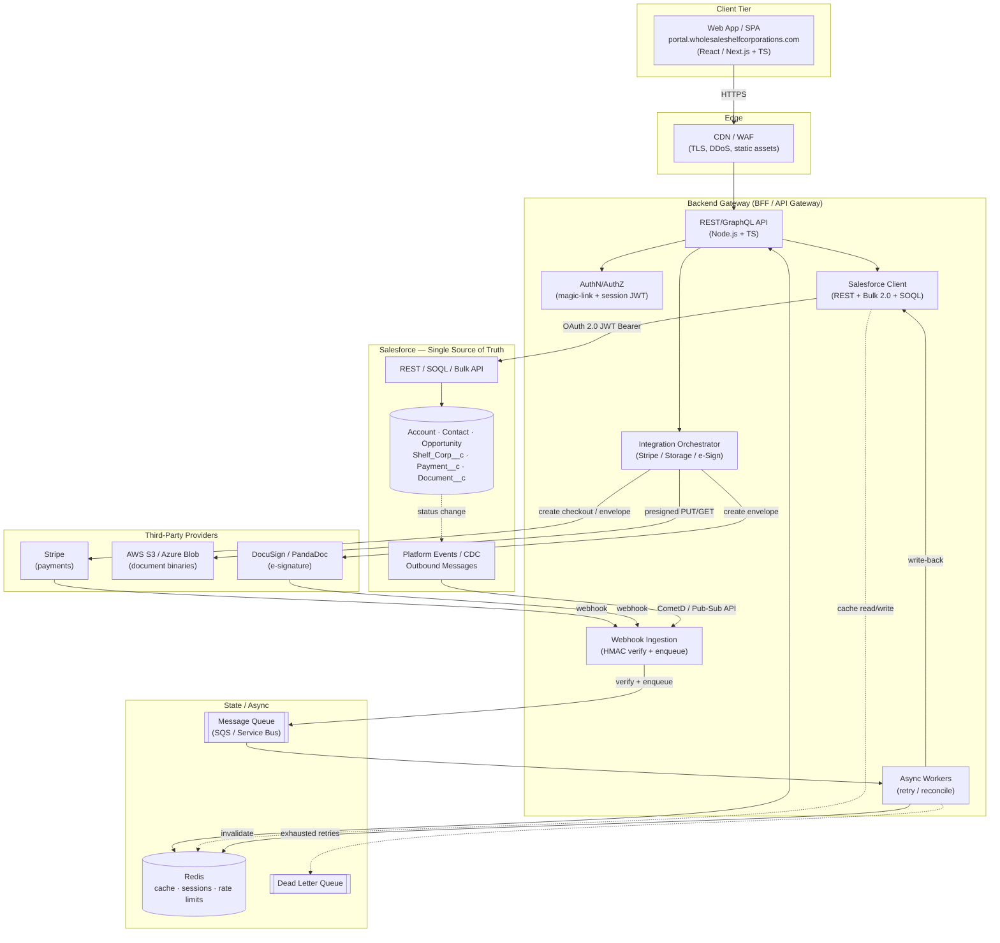
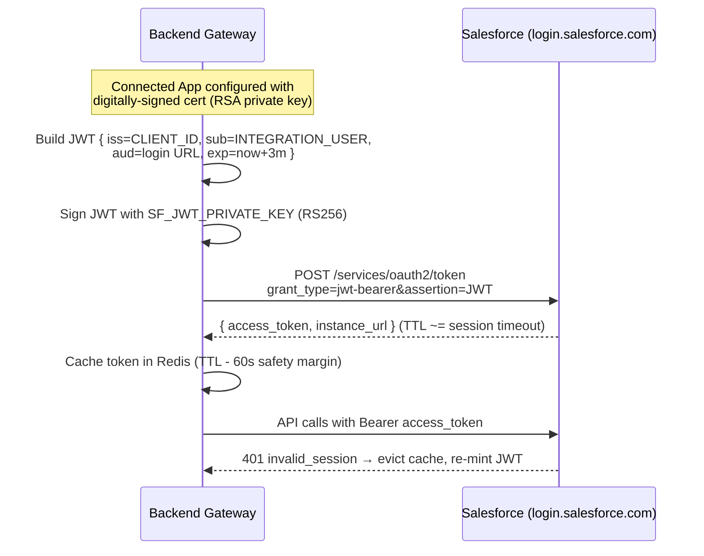
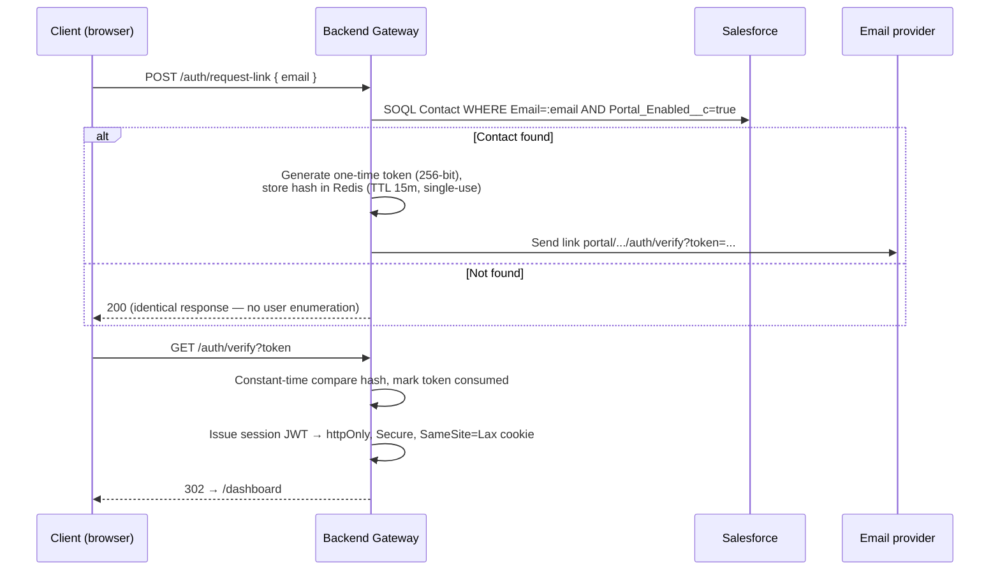
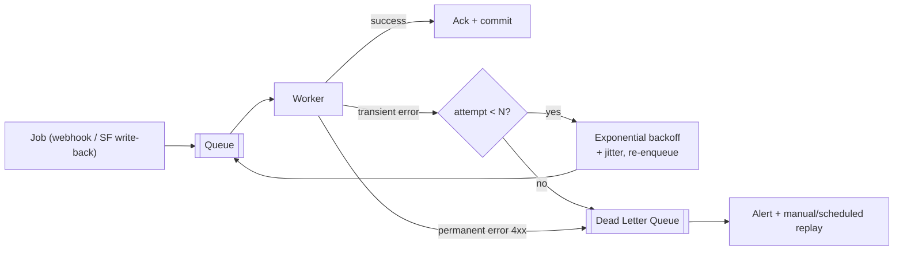

# WSC Client Portal — Hand-Off: Architecture & Integrations

> **Status:** Living document · **Owner:** Platform Engineering · **Audience:** Backend, Frontend, DevOps, Salesforce Admins
> **Source of Truth:** Salesforce (SFDC). The portal is a **read-mostly projection** of SFDC with a narrow set of write paths (payments, e-sign events, profile edits).
> **Scope note:** The repository currently ships a static prototype (`index.html`). This document specifies the production system that prototype represents. Where a value is illustrative, it is drawn from the prototype's sample order `#OO-1042`.

---

## 1. System Topology

### 1.1 Component responsibilities

| Node | Responsibility | Owns state? |
| --- | --- | --- |
| **Web App (SPA)** | Rendering, client session, optimistic UI. Talks **only** to the Backend Gateway. Never holds SFDC or third-party credentials. | No |
| **Backend Gateway (BFF)** | API composition, authZ, SFDC client, third-party orchestration, caching, webhook ingestion, retry/DLQ. The **only** node that holds secrets. | Cache/session only |
| **Salesforce (SSOT)** | Canonical business data: Accounts, Contacts, Opportunities, `Shelf_Corp__c`, `Payment__c`, documents metadata, status history. | **Yes (authoritative)** |
| **Stripe** | Card payments, hosted checkout, payment webhooks. | Payment intents |
| **AWS S3 / Azure Blob** | Binary document storage (PDFs). SFDC stores only metadata + object key. | Blobs |
| **DocuSign / PandaDoc** | E-signature envelopes for Purchase Agreements; completion webhooks. | Envelopes |
| **Redis** | SFDC response cache, session store, rate-limit token buckets, SFDC API-usage counter. | Ephemeral |
| **Message Queue + DLQ** | Async webhook processing, SFDC write retries, reconciliation. | In-flight jobs |

### 1.2 Topology diagram



### 1.3 Canonical flows

**A. Client login (passwordless magic link)**
`SPA → BFF /auth/request-link → email(one-time token) → SPA /auth/verify?token → BFF issues session JWT (httpOnly cookie)`. The BFF resolves the email to a SFDC `Contact` and caches the `Contact`/`Account`/`Opportunity` graph.

**B. Read order dashboard**
`SPA GET /me/order → BFF checks Redis → on miss, SOQL against Opportunity + child objects → shape DTO → cache (TTL) → return`.

**C. Pay balance (Stripe)**
`SPA POST /payments/checkout → BFF creates Stripe Checkout Session (idempotency key = Opportunity Id + amount + attempt) → SPA redirects → Stripe → webhook payment_intent.succeeded → BFF verifies HMAC → enqueue → worker upserts Payment__c + advances Opportunity stage → invalidate cache`.

**D. Document sign (DocuSign)**
`Advisor generates Purchase Agreement in SFDC → BFF creates envelope → client signs → DocuSign webhook envelope-completed → worker stores signed PDF in S3 → writes Document__c metadata → advances stage`.

**E. Status push (Salesforce → Portal)**
`Opportunity.StageName change → Platform Event / CDC → BFF subscriber → invalidate Redis order cache → (optional) email/notify client`.

---

## 2. Data Integration Matrix (SFDC Mapping)

**Direction legend:** `SF→App` (read/projection) · `App→SF` (write-back) · `⇄` (bidirectional).
**Sync legend:** `Real-time` (on request), `Event` (Platform Event/CDC/webhook), `Batch` (scheduled reconcile).

### 2.1 Standard objects

| App entity (DTO) | SFDC object | Key fields (SFDC API name) | Direction | Sync | Notes |
| --- | --- | --- | --- | --- | --- |
| `Client.company` | **Account** | `Id`, `Name`, `Type`, `Phone`, `BillingAddress` | SF→App | Real-time + Event | e.g. *Acme Holdings LLC*. Portal never creates Accounts. |
| `Client.contact` (account holder) | **Contact** | `Id`, `AccountId`, `FirstName`, `LastName`, `Email`, `Phone`, `Preferred_Language__c`, `Portal_Enabled__c` | ⇄ | Real-time | `Email` is the magic-link identity key (must be unique + indexed). Profile edits are the only client-writable Contact fields. |
| `Order` | **Opportunity** | `Id`, `Name` (`OO-####`), `Amount`, `StageName`, `CloseDate`, `Assigned_Advisor__c`, `Order_Number__c` | SF→App (stage), App→SF (payment-driven stage advance) | Real-time + Event | Sample: `OO-1042`, `Amount = 8750`. Stage is the pipeline backbone (see §2.3). |
| `Order.lineItem` (product) | **OpportunityLineItem** → **Product2** / **PricebookEntry** | `Product2Id`, `Quantity`, `UnitPrice`, `TotalPrice` | SF→App | Real-time | Links Opportunity to the specific `Shelf_Corp__c`. |
| `Advisor` | **User** (or Contact) | `Id`, `Name`, `Email` | SF→App | Real-time | Shown as *Rinkie S.* Expose display name only; never expose `User` PII beyond first name + initial. |

### 2.2 Custom objects

| App entity | SFDC custom object | Key fields | Direction | Sync | Notes |
| --- | --- | --- | --- | --- | --- |
| `ShelfCorp` (product purchased) | **`Shelf_Corp__c`** | `Name`, `Entity_Type__c` (*Wyoming LLC*), `Year_Established__c` (2016), `State_of_Formation__c`, `EIN__c`, `Good_Standing__c` (bool), `Credit_Ready_Features__c` (count/multi-select), `Time_In_Business__c`, `Buyout_Status__c` | SF→App | Real-time | **`EIN__c` is PII/sensitive** — mask to last 2 digits in DTO unless explicitly authorized. |
| `Payment` | **`Payment__c`** | `Opportunity__c`, `Amount__c`, `Method__c` (Card/Wire), `Status__c` (Pending/Verified/Failed/Refunded), `Stripe_PaymentIntent_Id__c`, `Verified_Date__c`, `Receipt_URL__c` | App→SF (create/verify), SF→App (history) | Event + Real-time | Two verified rows + one pending in sample (`$2,500 + $2,500`, balance `$3,750`). Card = Stripe webhook; Wire = manual advisor verification. **`Stripe_PaymentIntent_Id__c` unique-external-id → idempotent upsert.** |
| `Document` | **`Document__c`** (+ `ContentVersion` for native files) | `Opportunity__c`, `Type__c` (Purchase Agreement / Articles of Incorporation / EIN Letter), `Storage_Key__c` (S3/Blob), `File_Size__c`, `Uploaded_Date__c`, `Signature_Status__c`, `DocuSign_Envelope_Id__c` | SF→App | Event | Binaries in S3/Blob; SFDC holds metadata + key. Download via short-lived presigned URL from BFF. |
| `StatusEvent` (activity feed) | **`Order_Status_History__c`** (or Task/FeedItem) | `Opportunity__c`, `Old_Status__c`, `New_Status__c`, `Changed_By__c`, `Timestamp__c` | SF→App | Event | Powers the "Recent activity" / "Full status history" timeline. |
| `AdvisorNote` | **`Client_Note__c`** (or FeedItem) | `Opportunity__c`, `Body__c`, `Author__c`, `Visible_To_Client__c` | SF→App | Real-time | Only surface `Visible_To_Client__c = true`. |

### 2.3 Order status ↔ Opportunity StageName mapping

The portal's tracker and status pipeline map 1:1 to the Opportunity `StageName` picklist. **Never hardcode display labels** — resolve through this table.

| Portal stage (display) | `Opportunity.StageName` | Tracker node | Client-facing badge |
| --- | --- | --- | --- |
| To Verify Payment | `To_Verify_Payment` | Payment verified (pending) | `b-warn` Pending |
| Pending Balance | `Pending_Balance` | — | `b-warn` |
| Initial Contact | `Initial_Contact` | Initial contact | `b-ok` |
| Work Started | `Work_Started` | Work started (current) | `b-ok` Work Started |
| Waiting to Ship | `Waiting_To_Ship` | Ready to ship | `b-hold` |
| Shipped | `Shipped` | Shipped | `b-ok` |
| Delivered | `Delivered` | (Delivered) | `b-ok` |
| Complete | `Closed_Won` / `Complete` | Complete | `b-ok` |

> **Rule:** Stage transitions triggered by payment are performed by workers **against SFDC**, then reflected back to the portal via CDC/Platform Events. The portal must not treat its own optimistic UI state as authoritative.

---

## 3. Authentication & Security Flows

There are **two independent trust boundaries**. Do not conflate them.

### 3.1 Server-to-Server: Backend Gateway → Salesforce (OAuth 2.0 JWT Bearer)

Used for **all** SFDC access. No interactive login, no refresh-token storage — the BFF signs a JWT with a private key and exchanges it for a short-lived access token.



**Rules**
- `sub` is a dedicated **integration user** with least-privilege permission set — not a human admin.
- Private key (`SF_JWT_PRIVATE_KEY`) lives only in the secrets manager, mounted at runtime. Never in the repo, never in logs.
- Access token cached in Redis keyed per-instance; refreshed proactively (TTL − 60s) and reactively on `401 invalid_session_id`.
- The Connected App is pre-authorized (admin-approved) so no user consent screen is involved.

### 3.2 Client sessions: passwordless magic link

The prototype's "Send secure sign-in link — no password to remember" is the production auth model.



**Rules**
- Response to `/auth/request-link` is **always** identical (prevent account enumeration).
- Tokens are single-use, short-lived (≤15 min), stored **hashed**, invalidated on consumption.
- Session JWT: short access lifetime (~30–60 min) + sliding refresh; `httpOnly`, `Secure`, `SameSite=Lax`; signed with `SESSION_JWT_SECRET` (rotate-able, `kid` header).
- Every request is authorized against the resolved `Contact.Id` → `Account.Id`; **row-level scoping** ensures a client can only read their own Opportunity graph (enforced in BFF **and** via SFDC sharing rules on the integration user).
- Optional step-up 2FA (prototype exposes a "Two-factor authentication" toggle) — TOTP enrollment stored as `Contact.TwoFA_*` fields or in the auth store.

### 3.3 Transport & data protection
- TLS 1.2+ everywhere; HSTS at the edge.
- Secrets only in a managed store (AWS Secrets Manager / Azure Key Vault / Doppler); injected as env vars at runtime.
- PII fields (`EIN__c`, full `Email`, `Phone`) masked in logs and in DTOs by default.
- Webhook endpoints verify provider HMAC signatures **before** any processing (Stripe `Stripe-Signature`, DocuSign HMAC, SF Pub/Sub auth).

---

## 4. Fault Tolerance & Limits Strategy

### 4.1 Salesforce API limit mitigation (caching)

Salesforce enforces a **24h rolling API request limit** per org. The portal is read-heavy, so caching is the primary defense.

| Concern | Mechanism |
| --- | --- |
| Repeated dashboard reads | **Redis read-through cache** of shaped Opportunity DTOs. TTL 60–300s; invalidated eagerly by CDC/Platform Events on the relevant `Opportunity.Id`. |
| Reference/picklist data | Long TTL (hours) cache of stage labels, product catalog, advisor names. |
| API budget visibility | On each SFDC response, read the `Sforce-Limit-Info` header → store consumed/limit in Redis → expose on an internal `/health/sfdc-limits` gauge; alert at 80%. |
| Read amplification | **Composite / Composite-Graph API** to fetch Opportunity + children in one round-trip instead of N SOQL calls. |
| Bulk operations | Any operation over >200 records (reconciliation, batch status sync) uses **Bulk API 2.0**, never row-by-row REST. |
| Cache stampede | Per-key mutex / single-flight so a cold key triggers exactly one SOQL, not one-per-request. |

**Invalidation contract:** writes go to SFDC first; the resulting CDC/Platform Event is the trigger that evicts the cache. The BFF never leaves stale writes in cache after a confirmed SFDC mutation.

### 4.2 Webhooks & events (inbound)

| Source | Channel | Example events | Handling |
| --- | --- | --- | --- |
| Stripe | HTTPS webhook | `payment_intent.succeeded`, `charge.refunded`, `checkout.session.completed` | Verify `Stripe-Signature`; enqueue; worker upserts `Payment__c` by `Stripe_PaymentIntent_Id__c` (idempotent). |
| DocuSign / PandaDoc | HTTPS webhook (Connect) | `envelope-completed`, `recipient-completed` | Verify HMAC; enqueue; worker stores signed PDF → `Document__c` + stage advance. |
| Salesforce | **Pub/Sub API (gRPC)** / Platform Events / CDC; legacy **Outbound Messages** (SOAP) | `OpportunityChangeEvent`, custom `Order_Status__e` | Subscriber invalidates cache + optionally notifies client. Prefer Pub/Sub API over CometD/Streaming for durability (replay IDs). |

**Webhook rules**
- **Verify signature → return 2xx fast → process async.** Never do SFDC writes inline in the webhook handler.
- **Idempotency:** persist the provider event id; drop duplicates (providers retry). Store `replayId` for SFDC events to resume after downtime.
- Reject unsigned/replayed/expired-timestamp payloads.

### 4.3 Retry policies & Dead Letter Queue



- **Transient** (5xx, timeouts, `REQUEST_LIMIT_EXCEEDED`, `UNABLE_TO_LOCK_ROW`): retry with exponential backoff + jitter, capped attempts (e.g. 5).
- **Permanent** (validation rule, malformed payload, 4xx): straight to DLQ, no retries — surface for engineer/advisor review.
- **Idempotency keys** on every mutating call so retries never double-charge or double-write (`Payment__c` upsert on external id; Stripe idempotency key = `Opportunity.Id + amount + attempt`).
- **Circuit breaker** around SFDC and each third-party: open on sustained failure, serve cached reads, queue writes for later drain.
- **DLQ** = SQS DLQ / Azure Service Bus dead-letter subqueue; monitored with alerting; supports manual + scheduled replay.
- **Nightly reconciliation batch** compares Stripe charges ↔ `Payment__c` and storage objects ↔ `Document__c`, repairing drift the event path missed.

### 4.4 Failure-mode summary

| Failure | Detection | Response |
| --- | --- | --- |
| SFDC 401 invalid session | API response | Evict token, re-mint JWT, retry once |
| SFDC API limit near cap | `Sforce-Limit-Info` | Shed load to cache, defer batch jobs, alert |
| SFDC down | Circuit breaker | Serve cache, queue writes, status banner |
| Stripe webhook missed | Reconciliation batch | Backfill `Payment__c` from Stripe API |
| Duplicate webhook | Event-id dedupe | Drop, ack 200 |
| Poisoned job | Retry exhaustion | Route to DLQ + alert |

---

## 5. Environment Variables & CI/CD

### 5.1 Environment variable inventory (names only — **never commit values**)

**Salesforce (JWT Bearer)**
```
SF_LOGIN_URL                # https://login.salesforce.com | https://test.salesforce.com
SF_CLIENT_ID                # Connected App consumer key (JWT iss)
SF_INTEGRATION_USERNAME     # dedicated integration user (JWT sub)
SF_JWT_PRIVATE_KEY          # RSA private key (from secrets manager; PEM or ref)
SF_API_VERSION              # e.g. v60.0
SF_PUBSUB_ENDPOINT          # api.pubsub.salesforce.com:7443
```

**Session / Auth**
```
SESSION_JWT_SECRET          # signing key for portal session tokens
SESSION_JWT_KID             # active key id (supports rotation)
MAGIC_LINK_TTL_SECONDS      # e.g. 900
APP_BASE_URL                # https://portal.wholesaleshelfcorporations.com
```

**Stripe**
```
STRIPE_SECRET_KEY
STRIPE_WEBHOOK_SECRET       # for Stripe-Signature verification
STRIPE_PUBLISHABLE_KEY      # client-side; safe to expose
```

**Document storage (choose one)**
```
# AWS
AWS_REGION
AWS_S3_BUCKET
AWS_ACCESS_KEY_ID           # prefer IAM role / OIDC over static keys
AWS_SECRET_ACCESS_KEY
# Azure
AZURE_STORAGE_ACCOUNT
AZURE_STORAGE_CONTAINER
AZURE_STORAGE_CONNECTION_STRING   # prefer Managed Identity
```

**E-signature**
```
DOCUSIGN_INTEGRATION_KEY
DOCUSIGN_USER_ID
DOCUSIGN_ACCOUNT_ID
DOCUSIGN_PRIVATE_KEY
DOCUSIGN_WEBHOOK_HMAC_KEY
# or PandaDoc
PANDADOC_API_KEY
PANDADOC_WEBHOOK_SECRET
```

**Infrastructure**
```
REDIS_URL
QUEUE_URL                   # SQS / Service Bus connection
DLQ_URL
EMAIL_PROVIDER_API_KEY      # magic-link + notifications (SES/SendGrid/Postmark)
LOG_LEVEL
SENTRY_DSN                  # or equivalent error tracking
```

### 5.2 CI/CD requirements
- **Secrets:** sourced from the platform secrets manager and injected as env at deploy time. CI holds **no** long-lived cloud keys — use OIDC federation to assume roles. Pipeline **fails** on any secret detected in the diff (gitleaks/trufflehog gate).
- **Environments:** `dev` → SFDC sandbox (`test.salesforce.com`); `staging` → dedicated sandbox / full copy; `prod` → production org. Each has its own Connected App + integration user + key pair.
- **Pipeline stages:** lint + typecheck → unit tests → integration tests (SFDC sandbox + Stripe test mode + storage) → build → deploy → post-deploy smoke (magic-link issue, dashboard read, Stripe test webhook).
- **SFDC metadata:** Connected App, custom objects/fields, permission sets, and Pub/Sub subscriptions are versioned as SFDC DX source and deployed via `sf project deploy` — not clicked in prod.
- **Rollback:** immutable build artifacts, blue/green or canary; cache/session are ephemeral so rollback is stateless on the BFF side.
- **Health & observability:** `/health` (liveness), `/health/sfdc-limits` (API budget), structured logs with request/correlation ids, DLQ depth + webhook lag dashboards with alerting.

---

## Appendix A — Glossary pointer
Business-domain terms (Shelf Corporation, Aged Corp, EIN, Good Standing, Buyout, Credit-Ready, etc.) are defined in the AI context file [`../CLAUDE.md`](../CLAUDE.md) §3, which is the canonical glossary for both humans and AI assistants working in this repo.
